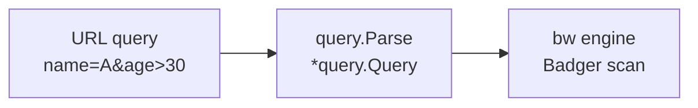
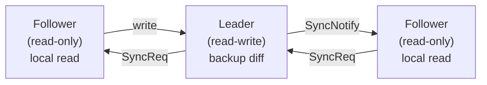

# bw

[](https://raw.githubusercontent.com/rakunlabs/bw/main/LICENSE)
[](https://sonarcloud.io/summary/overall?id=rakunlabs_bw)
[](https://github.com/rakunlabs/bw/actions)
[](https://goreportcard.com/report/github.com/rakunlabs/bw)
[](https://pkg.go.dev/github.com/rakunlabs/bw)


`bw` is a thin wrapper around [BadgerDB](https://github.com/dgraph-io/badger)
that exposes a typed bucket API, plus a query engine that consumes
[`github.com/rakunlabs/query`](https://github.com/rakunlabs/query)
expressions directly. URL query strings translate into Go-side filtering,
sorting and pagination over Badger key prefixes.



## Install

```sh
go get github.com/rakunlabs/bw
```

---

## Quick start

```go
package main

import (
    "context"
    "log"

    "github.com/rakunlabs/bw"
    "github.com/rakunlabs/query"
)

// One tag set drives both the bw schema (pk/index/unique flags) and
// the on-wire field name. The codec honours `bw:"-"` to skip a
// field. No codegen needed.
type User struct {
    ID    string `bw:"id,pk"`
    Name  string `bw:"name,index"`
    Email string `bw:"email,unique"`
    Age   int    `bw:"age,index"`
    Bio   string `bw:"-"`             // never serialized
}

func main() {
    db, err := bw.Open("/var/lib/myapp")
    if err != nil { log.Fatal(err) }
    defer db.Close()

    users, err := bw.RegisterBucket[User](db, "users")
    if err != nil { log.Fatal(err) } // fails clearly if you forgot `go generate`

    ctx := context.Background()

    err = users.InsertMany(ctx,
      []*User{
        {ID: "1", Name: "Kemal Sunal", Email: "a@x", Age: 30},
        {ID: "2", Name: "Tarık Akan", Email: "b@x", Age: 25},
      },
    )
    if err != nil { log.Fatal(err) }

    u, _ := users.Get(ctx, "1")
    log.Println(u.Name) // Kemal Sunal

    q, _ := query.Parse("name=Tarık Akan|age[gt]=29&_sort=-age&_limit=10")
    got, _ := users.Find(ctx, q)
    log.Println(got)
}
```

### Tag flags

```go
ID    string `bw:"id,pk"`           // primary key
Name  string `bw:"name,index"`      // ordered index, range/sort friendly
Email string `bw:"email,unique"`    // uniqueness constraint (lookup-style)
User  string `bw:"user,index,unique"` // both: indexed AND unique (allowed)
Tag   string `bw:"-"`               // skip
```

`pk`, `index` and `unique` parse independently; combine them freely.

### Composite indexes and unique constraints

Use `index:groupname` or `unique:groupname` to combine multiple fields
into a single index or unique constraint. Fields sharing the same group
name are concatenated in struct declaration order.

```go
type Location struct {
    ID      string `bw:"id,pk"`
    Country string `bw:"country,index:region"`         // composite index "region"
    City    string `bw:"city,index:region"`             // same group → key is (country, city)
    Code    string `bw:"code,unique:country_code"`      // composite unique "country_code"
    Prefix  string `bw:"prefix,unique:country_code"`    // same group → (code, prefix) must be unique together
    Name    string `bw:"name,index"`                    // plain single-field index (unchanged)
}
```

**Composite indexes** are used by the query planner when all constituent
fields appear as equality conditions:

```
country=TR&city=Istanbul  → composite index seek on "region"
country=TR                → full scan (only 1 of 2 fields supplied)
country=TR&city=Istanbul&name=foo → composite seek + residual filter on name
```

**Composite unique constraints** enforce that the combination of all
grouped fields is unique across the bucket. Individual field values may
repeat as long as the full tuple is distinct:

```
(Code="TR", Prefix="34") + (Code="TR", Prefix="06")  → OK
(Code="TR", Prefix="34") + (Code="TR", Prefix="34")  → ErrConflict (on different PKs)
```

### Schema evolution (adding/removing fields)

When you change a struct (add new fields, add/remove indexes), use
`WithVersion` to tell `RegisterBucket` to auto-migrate:

```go
// V1 — original schema.
type User struct {
    ID   string `bw:"id,pk"`
    Name string `bw:"name,index"`
}

// V2 — added Email (unique) and Age (indexed).
type User struct {
    ID    string `bw:"id,pk"`
    Name  string `bw:"name,index"`
    Email string `bw:"email,unique"`
    Age   int    `bw:"age,index"`
}
```

```go
// Bump the version number each time you change the index/unique surface.
// RegisterBucket auto-migrates when stored version < provided version.
users, err := bw.RegisterBucket[User](db, "users", bw.WithVersion[User](2))
if err != nil {
    log.Fatal(err)
}
```

That's it. No manual two-step `MigrateBucket` call needed — just bump
the version number when you change the struct.

**What happens under the hood (incremental):**

It does NOT drop all indexes and rebuild everything. It diffs the old
schema against the new one and only touches what changed:

1. Fields that **lost** their `index` tag → only those index keys are deleted.
2. Fields that **lost** their `unique` tag → only those unique keys are deleted.
3. Fields that are **newly** indexed/unique → scans data and builds entries
   only for those fields.
4. Fields whose flags are **unchanged** → left completely alone (no I/O).
5. Updates the stored fingerprint, version, and manifest.

**Rules:**

- Additive changes (new fields) are safe — old records get zero values.
- Removing an index is safe — the stale index keys are cleaned up.
- Changing the primary key field or its `bw` tag name requires a manual
  data migration (you'd need to re-key every record).
- Zero-value unique fields (empty string, nil slice) are skipped during
  migration to avoid false conflicts on old records that lack the new
  field.
- If you don't provide `WithVersion`, the old strict behavior applies
  (fingerprint mismatch = error). You can still call `MigrateBucket`
  explicitly in that case.

### Defaults

```go
bw.DefaultCacheSize int64 = 100 << 20   // 100 MiB block cache (Badger default is 256 MiB)
bw.DefaultLogSize   int64 = 100 << 20   // 100 MiB value-log file size (Badger default is 1 GiB)
```

These are package-level vars. Either change them at process start or use
`WithBadgerOptions` to take full control.

---

## Query syntax

`bw` consumes whatever `query.Parse` produces, so the operator set is
identical to the upstream package:

| Operator | Meaning | Example |
| --- | --- | --- |
| `eq` (default) | equal | `name=Alice` |
| `ne` | not equal | `name[ne]=Alice` |
| `gt`, `gte`, `lt`, `lte` | numeric / lexicographic comparison | `age[gte]=18` |
| `like`, `ilike` | SQL-style `%`/`_` wildcards (i = case-insensitive) | `name[like]=A%25` (URL-encode `%`) |
| `nlike`, `nilike` | negated `LIKE` / `ILIKE` | |
| `in` (implicit on `,`) | membership | `country=US,DE,FR` |
| `nin` | not in | `status[nin]=banned,deleted` |
| `is`, `not` | IS NULL / IS NOT NULL | `deleted_at[is]=` |
| `kv` | JSONB-style containment | `meta[kv]=eyJhIjoxfQ` |
| `jin`, `njin` | array has any / none | `tags[jin]=admin,editor` |

Logical: `&` for AND, `|` for OR, `()` to group.
Pagination: `_sort=field,-other`, `_limit=N`, `_offset=N`.
Projection: `_fields=id,name` (returned as `Query.Select`).

Dot-paths work for nested values and slice indexing:

```
address.city=Berlin
items.0.name[like]=foo%25
```

---

## Backup & restore

Every `*bw.DB` exposes backup, restore and version methods backed by
Badger's streaming backup format.

```go
// Current database version (monotonically increasing uint64).
ver := db.Version()

// Full backup.
var buf bytes.Buffer
since, _ := db.Backup(&buf, 0, false)

// Incremental backup (only entries newer than `since`).
db.Backup(&buf, since, false)

// Backup with deleted data (preserves delete markers for point-in-time).
db.Backup(&buf, 0, true)

// Point-in-time backup: only entries with version <= savedVersion.
db.BackupUntil(&buf, savedVersion)

// Restore into a (typically fresh) database.
db2.Restore(&buf)
```

| Method | Description |
| --- | --- |
| `Backup(w, since, deletedData)` | Incremental backup; set `deletedData=true` to preserve delete markers |
| `BackupUntil(w, until)` | Point-in-time backup up to a given version |
| `Restore(r)` | Load a backup into the database |
| `Version()` | Current max transaction version |

---

## Cluster mode

The `cluster` sub-package adds multi-node replication on top of bw using
[alan](https://github.com/rakunlabs/alan) for UDP peer discovery and
leader election.

```sh
go get github.com/rakunlabs/bw/cluster
```

### How it works



- **Leader election**: alan's distributed lock (`LeaderLoop`). If the
  leader crashes, another node acquires the lock automatically.
- **Writes**: only the leader writes. The application routes writes via
  `IsLeader()` check and its own transport, or uses the built-in
  `Forward()` helper (see below).
- **Reads**: always local. Every node serves reads from its own database.
- **Sync after write**: leader calls `NotifySync()`, followers see they
  are behind, pull the incremental diff via request-reply, and apply it.
- **Periodic sync**: followers poll the leader every N minutes (default 5)
  as a safety net.
- **Leader catch-up**: a newly elected leader asks all peers for their
  version and pulls the diff from whichever peer is furthest ahead.

### Usage

```go
package main

import (
    "context"
    "log"
    "time"

    "github.com/rakunlabs/alan"
    "github.com/rakunlabs/bw"
    "github.com/rakunlabs/bw/cluster"
)

type User struct {
    ID   string `bw:"id,pk"`
    Name string `bw:"name,index"`
}

func main() {
    ctx, cancel := context.WithCancel(context.Background())
    defer cancel()

    // 1. Open the database.
    db, err := bw.Open("/var/lib/myapp")
    if err != nil { log.Fatal(err) }
    defer db.Close()

    // 2. Create an alan instance (do NOT call Start yourself).
    a, err := alan.New(alan.Config{
        DNSAddr:  "myapp-headless.default.svc.cluster.local",
        Port:     7946,
        Replicas: 3,
    })
    if err != nil { log.Fatal(err) }

    // 3. Create and start the cluster.
    c := cluster.New(db, a,
        cluster.WithSyncInterval(5*time.Minute),
        cluster.WithLockKey("myapp-leader"),
        cluster.WithOnLeaderChange(func(isLeader bool) {
            log.Println("leader:", isLeader)
        }),
    )
    if err := c.Start(ctx); err != nil { log.Fatal(err) }
    defer c.Stop()

    // 4. Register buckets as usual.
    users, _ := bw.RegisterBucket[User](db, "users")

    // 5. Reads — always local.
    u, _ := users.Get(ctx, "u1")
    _ = u

    // 6. Writes — leader only.
    if c.IsLeader() {
        _ = users.Insert(ctx, &User{ID: "u1", Name: "Elif"})
        c.NotifySync()
    }
}
```

### Options

| Option | Default | Description |
| --- | --- | --- |
| `WithLockKey(key)` | `"bw-leader"` | Distributed lock name for leader election |
| `WithSyncInterval(d)` | `5m` | How often followers poll the leader |
| `WithOnLeaderChange(fn)` | `nil` | Callback when leadership changes |
| `WithPrefix(s)` | `"bw"` | Message namespace prefix (see below) |
| `WithForwardHandler(fn)` | `nil` | Handler for forwarded requests on the leader |

### Message prefix

If the same alan instance is shared by multiple subsystems (e.g. your app
uses alan for its own protocol alongside `bw/cluster`), messages can
collide. Every cluster message is prefixed with a namespace string
(default `"bw"`). Messages without the expected prefix are silently
ignored.

```go
// Two independent clusters on the same alan instance:
c1 := cluster.New(db1, a, cluster.WithPrefix("users"))
c2 := cluster.New(db2, a, cluster.WithPrefix("orders"))
```

### Forwarding writes to the leader

`Forward` sends an application-level request to the current leader over
alan's request-reply and returns the response. If the calling node is
already the leader, the handler runs locally without a network hop.

This eliminates the need for a separate HTTP/gRPC forwarding layer for
simple or moderate-sized writes.

```go
c := cluster.New(db, a,
    cluster.WithForwardHandler(func(ctx context.Context, data []byte) []byte {
        var req CreateUserRequest
        json.Unmarshal(data, &req)

        _ = users.Insert(ctx, &User{ID: req.ID, Name: req.Name})
        c.NotifySync()

        resp, _ := json.Marshal(CreateUserResponse{OK: true})
        return resp
    }),
)

// In your HTTP handler (works on any node):
func (s *Server) CreateUser(w http.ResponseWriter, r *http.Request) {
    body, _ := io.ReadAll(r.Body)
    resp, err := s.cluster.Forward(r.Context(), body)
    if err != nil {
        http.Error(w, err.Error(), 502)
        return
    }
    w.Write(resp)
}
```

> **Note:** Forward uses alan's QUIC-based transport, so there is no payload size limit.
